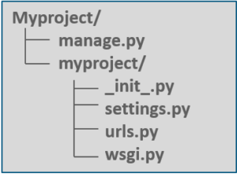
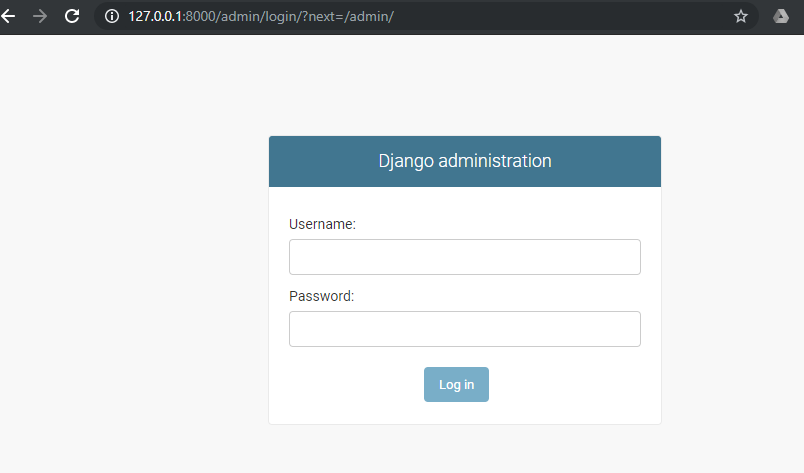

# PyDjango-Demo

Description: 
Sample app to test out Python/Django fullstack capabilities 

* [Versions](#Current-Local-Set-Up)
* [Start-Up Doc](#Steps-For-Easy-Start-Up)  
    1. Download
    2. Create Scaffolding
        * Project Explanation
    3. Create App
    4. Check Installed Dependencies
    5. Create View 
    6. Map the View
    7. Map the URLs
    8. Start the server  
* [Issues & Solutions ](#Issues)
* [Additional Work](#Additional-Work)
* [Resources](#Resources)


## Current Local Set-Up
| Software | Version |
| -------- |:-------:| 
|Python    |3.7.64   |
|Pip       |19.2.1   |
|Django    |2.2.4    |

## Steps for Easy Start-Up
### 1. Download [Django](https://www.djangoproject.com/download/)
```python
pip install Django==2.2.4
```
   
### 2. Create the project scaffold 
```python
 django-admin startproject <myproject>
``` 

 #### __What's going on in myproject:__ 

manage.py – It is a command-line utility that lets you interact with this Django project in various ways. 

'myproject/' – It is the actual Python package for your project. It is used to import anything, say –  myproject.urls. 

init.py – Init just tells the python that this is to be treated like a python package.

settings.py – This file manages all the settings of your project. 

urls.py – This is the main controller which maps it to your website.

wsgi.py – It serves as an entry point for WSGI compatible web servers.

  

### 3. Create your app. 
Navigate to the myproject directory and type the following:  

```python
python manage.py startapp webapp
```

### 4. Check your dependencies.
Open the myproject/settings.py, and add the following:

```python
    INSTALLED_APPS = (
    'webapp',
    'django.contrib.admin',
    'django.contrib.auth',
    'django.contrib.contenttypes',
    'django.contrib.sessions',
    'django.contrib.messages',
    'django.contrib.staticfiles',
    )
```

### 5. Create a view! 
Open webapp/views.py and add the following:

```python
    from django.shortcuts import render
    from django.http import HttpResponse
    
    def index(request):
        return  HttpResponse("<H2>HEY! Welcome to Myproject! </H2>")
```
### 6. Map the view to a URL. 
Create a new file ("urls.py") inside the webapp. In webapps/urls.py, input the following code:

```python
    from django.conf.urls import url
    from . import views
    urlpatterns = [
     url(r'^$', views.index, name='index'),
    ]
```
**Note: The url pattern is in regular expression format where ^ stands for beginning of the string and $ stands for the end.**

### 7. Map the Webapps URL to the Project URLs 
Point the root URLconfig at the webapp.urls module. Input this into myproject/urls.py:

```python
    from django.conf.urls import include, url
    from django.contrib import admin
 
    urlpatterns = [
        url(r'^admin/', include(admin.site.urls)),
        url(r'^webapp/', include('webapp.urls')),
    ]
```

 We have now added the webapp and included the webapp.urls. Now don’t forget to import django.conf.urls.include and insert an include() in the urlpatterns list. The include() function allows referencing other URLconfs. 

 Note that the regular expression doesn’t have a ‘$’ but rather a trailing slash, this means whenever Django encounters include(), it chops off whatever part of the URL matched up to that point and sends the remaining string to include URLconf for further processing.

### 8. Start the server, and go to go to http://localhost:8000/webapp/
```python
python manage.py runserver
```


Special thanks to the www.edureka.com who this start-up guide came from. See it here at [Django Tutorial ](https://www.edureka.co/blog/django-tutorial/)


## Issues

So you've upgraded to a new and shiny Django 2.0 (or Wagtail 2.0), start your server and boom, you got slapped by this error:  

```
django.core.exceptions.ImproperlyConfigured: Passing a 3-tuple to include() is not supported. Pass a 2-tuple containing the list of patterns and app_name, and provide the namespace argument to include() instead.
Most probably, you have a problem in your main urls.py file:

url(r'^admin/', include(admin.site.urls)),
```
Do you see [admin.site.urls](.\pydjango\pydjango\urls.py) wrapped by include(), this is what Django (Wagtail) isn't happy about. 

The solution is to register your Django admin route like this:  
```python
url(r'^admin/', admin.site.urls),
```

And now all should be fine!

Source for this solution: <https://timonweb.com/tutorials/solving-djangocoreexceptionsimproperlyconfigured-passing-a-3-tuple-to-include-error-after-djangowagtail-20-upgrade/>

## Additional Work
    Goal: Let's create the http://localhost:8000/admin/ page
### 1. Create the myproject/admin directory
```python
     mkdir ./myproject/admin 
```

### 2. Create myproject/admin/urls.py
Add the following code:   

```python
    from django.conf.urls import url
    from . import views

    urlpatterns = [
     url(r'^$', views.index, name='index'),
    ]
```


### 3. Create myproject/admin/views.py
Add the following code:   

```python
    from django.shortcuts import render
    from django.http import HttpResponse

    # Create your views here.
    def index(request):
        return HttpResponse("<H2>Welcome to the PyDjango Admin Page! </H2>")
```

### 4. Test it out!
Run:  
```python
    python manage.py runserver
```

Check out the admin page. Go to http://127.0.0.1:8000/admin/

You should be redirected to a login page set-up automagically by Django's scaffolding.  




## Resources
Project Sourced From:  
    * [Edureka](https://www.edureka.co/blog/django-tutorial/)  

More Django Resources:  
    * [TimonWeb](https://timonweb.com/technologies/django/) - Roughly 60 articles on tutorials, demos, best practices, and common error messages  
    * [Django Doc](https://docs.djangoproject.com/en/2.2/intro/install/) - Quick Install  
    * [dzone](https://dzone.com/articles/nodejs-vs-djangois-javascript-better-than-python) - Why Django: NodeJS vs Django  
    * [scotch.io](https://scotch.io/tutorials/build-a-to-do-application-using-django-and-react) - React and Django: Let's Make an App  
    * [DigitalOcean](https://www.digitalocean.com/community/tutorials/how-to-create-a-django-app-and-connect-it-to-a-database) - How To Create a Django App & Connect it to a MySQL Database  
    * [DataRequest](https://www.dataquest.io/blog/web-scraping-tutorial-python/) - Weather Service Web-Scraping with Python